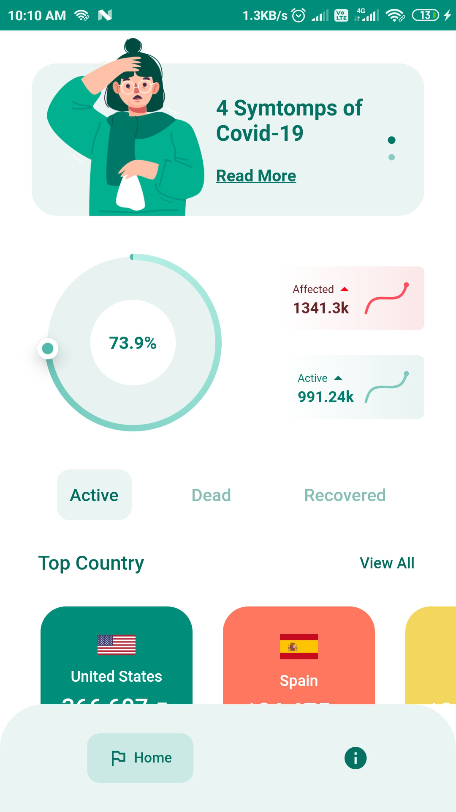
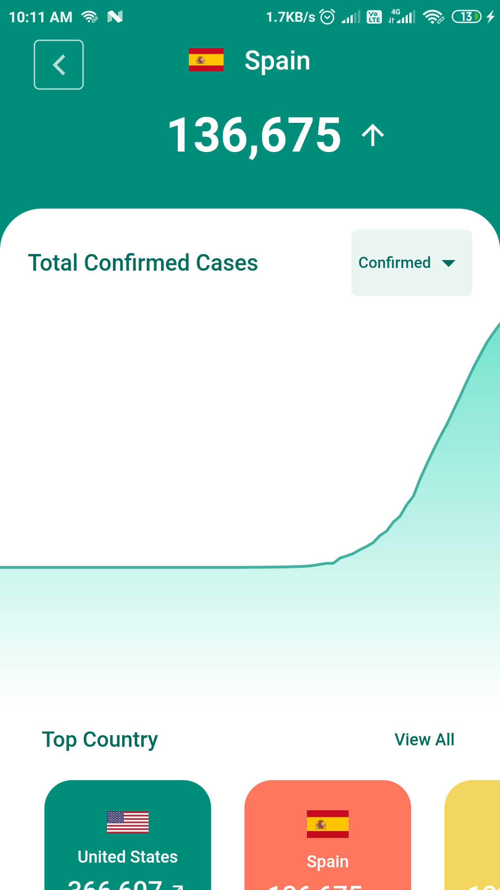
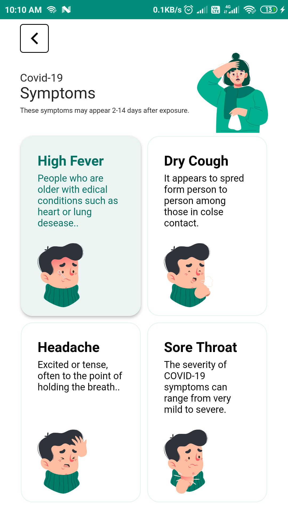
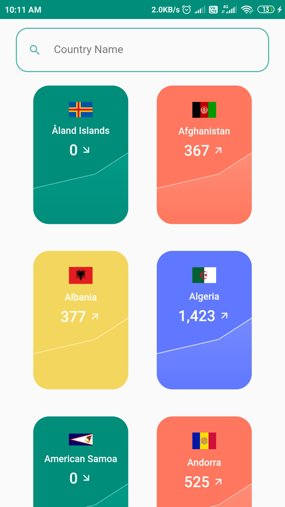
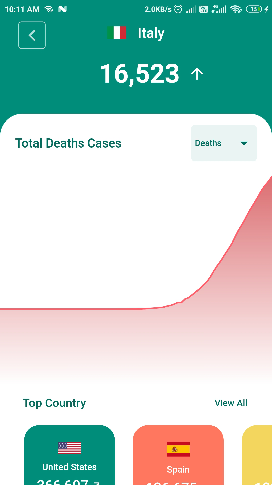
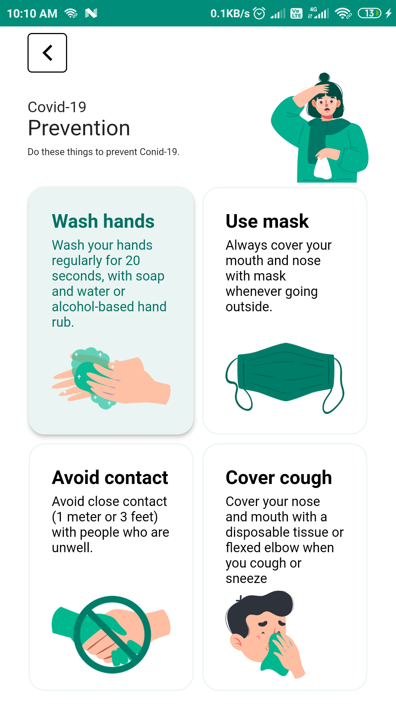
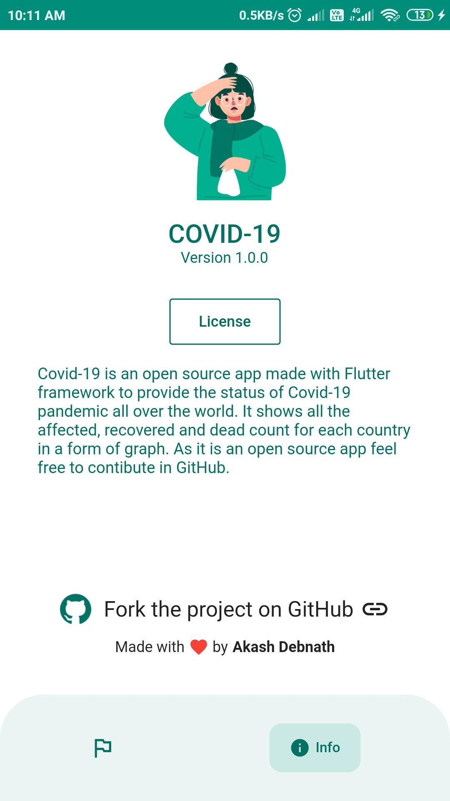

<h1 align="center">
  
   ⭐ COVID-19 ⭐  
</h1>
<h4 align="center">
  Built with ❤︎ by
  <a href="https://github.com/noobcoder17">Akash Debnath</a>
</h4>

This project is made using Flutter framework.In this app you can check the daily count of covid-19 cases of every country.They are shown in a form of 3 graphs, confirmed, recovered and death cases. The api used to get the data can be found <a href="https://covid19api.com/">here</a>

  
 

The UI is taken from <a href="https://dribbble.com/shots/10847147-Coronavirus-Covid-19-Dashboard">Dribbble</a>

  
  
   

  
  
   

  
  

